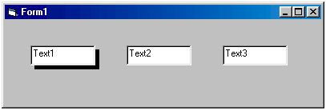



## The easiest way to add shadow to controls

### Description

An easy code -

It will put a shadow behind the control which is currently focussed and will loose the shadow when the control has lost focus.
 
### More Info
 

             |
---                |---
**Submitted On**   |2002-05-02 09:23:06
**By**             |[Nitin Bagga](https://github.com/Planet-Source-Code/PSCIndex/blob/master/ByAuthor/nitin-bagga.md)
**Level**          |Beginner
**User Rating**    |4.5 (18 globes from 4 users)
**Compatibility**  |VB 5\.0, VB 6\.0
**Category**       |[Miscellaneous](https://github.com/Planet-Source-Code/PSCIndex/blob/master/ByCategory/miscellaneous__1-1.md)
**World**          |[Visual Basic](https://github.com/Planet-Source-Code/PSCIndex/blob/master/ByWorld/visual-basic.md)
**Archive File**   |[The\_easies78367522002\.zip](https://github.com/Planet-Source-Code/nitin-bagga-the-easiest-way-to-add-shadow-to-controls__1-34327/archive/master.zip)

